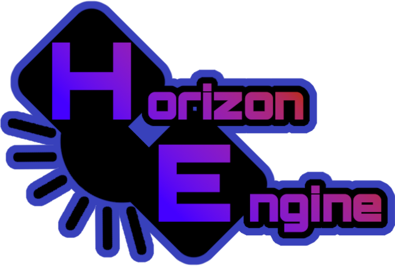

<p align="center">
  
  <h1 align="center">Friday Night Funkin': Horizon Engine</h1>
  <h4 align="center">A rewrite of Friday Night Funkin', built for mods and made for fun.</h4>
</p>

---

> [!NOTE]
> Horizon Engine is very incomplete, do not use it for mods.

## Compilation Instructions

1. Install Haxe 4.3.6 (and install MSVC if on Windows)

> [!NOTE]
> You may need to install extra packages on Linux to compile lime, see [here](https://github.com/openfl/lime)

2. Run the following commands

```bash
haxelib install hxpkg
haxelib run hxpkg install
haxelib run lime rebuild cpp -release
```

3. Run the build script in `build` (e.g `build\windows.bat` for Windows)

## Special Thanks

- FunkinCrew
  - [The Game](https://github.com/FunkinCrew/Funkin)
  - [Assets](https://github.com/FunkinCrew/funkin.assets) - ([See License](https://github.com/FunkinCrew/funkin.assets/blob/main/LICENSE.md))
- [Psych Engine](https://github.com/ShadowMario/FNF-PsychEngine) - Assets and Code

## Credits

- [Cobalt Bar](https://cobaltbar.github.io) - Main Developer
- [Plank](https://plankdev.carrd.co/) - Main Artist
- crowplexus and nebulazorua - Alt+Enter cancel + F11 fullscreen
- [superpowers04](https://github.com/superpowers04) - Safer FlxGame
- [CoreCat](https://corecathx.github.io/) - Utility functions, Device Info code, Windows.hx code
- [Sword352/FnF-Eternal](https://github.com/Sword352/FnF-Eternal) - Tiled Sprite
